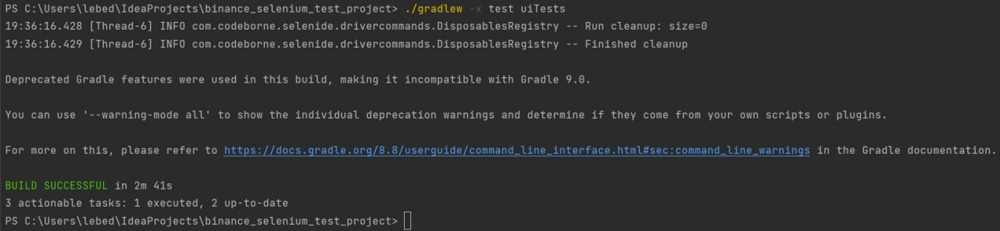
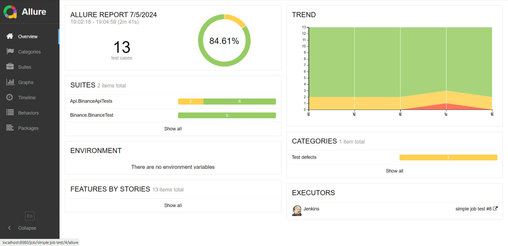
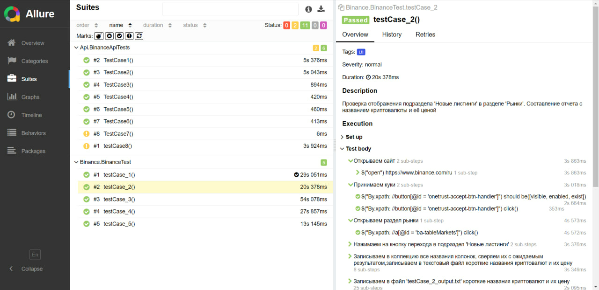

# Проект по автоматизации тестирования криптобиржи Binance
## :house: Содержание
> ➠ [Покрытый функционал](#rocket-покрытый-функционал)
>> ➠ [UI](#one-ui)
>>
>> ➠ [API](#two-api)
>
> ➠ [Инструкция создания API ключей на криптобирже Binance](#memo-инструкция-создания-api-ключей-на-криптобирже-binance)
>
> ➠ [Инструкция интеграции API ключей в проект](#triangular_flag_on_post-инструкция-интеграции-api-ключей-в-проект)
>
> ➠ [Технологический стек](#classical_building-технологический-стек)
>
> ➠ [Запуск тестов из терминала локально](#computer-запуск-тестов-из-терминала-локально)
>
> ➠ [Запуск тестов в Jenkins удаленно](#black_medium_small_square-запуск-тестов-в-jenkins-удаленно)
>
> ➠ [Allure отчет](#white_medium_small_square-allure-отчет)
>

## :rocket: Покрытый функционал

#### Разработаны UI и API автотесты.

> Расписанные <code>Тест-кейсы</code> с шагами и ожидаемыми результатами добавлены по ссылке: https://docs.google.com/spreadsheets/d/14NOyJwv3yNsI28cOFDuwuyxbWQtfWPhk0gufHLo6Fpo/edit?usp=sharing
>
> (Можно менять листы внизу: GUI, API)

### :one: UI
- [x] Проверка функционирования раздела 'Рынки':
>- Проверка функциональности добавления криптовалютной пары 'в избранное' (TestCase 1).
>- Проверка корректного отображения названия криптовалюты в паре в подразделе 'Избранное' (TestCase 1).
>- Проверка отображения подраздела "Новые листинги", получение файла-отчета с названиями криптовалюты и их ценами (TestCase 2).
- [x] Проверка функционирования раздела 'Торговля/Спот':
>- Проверка отображения графика криптовалютной пары (TestCase 3).
>- Проверка функциональности редактирования подраздела "Технический индикатор" в разделе "График" страницы криптовалюты (TestCase 3).
- [x] Проверка функционирования раздела "Binance Square":
>- Получения href атрибута статьи статьи, занимающей первую колонку - (TestCase 4).
- [x] Проверка функционирования раздела "Binance Earn":
>- Получение данных из меню поиска криптовалют - (TestCase 5).

### :two: API
>- Проверка подключения (TestCase 1).
>- Получение актуального серверного времени (TestCase 2).
>- Получение информации о текущих правилах биржевой торговли и символе 'BTCUSDT' (TestCase 3).
>- Получение статистики изменения цены криптовалютной пары 'DOGE/USDT' за последние 24 часа (TestCase 4).
>- Получение актуальной цены криптовалютной пары 'ETH/USDT' (TestCase 5).
>- Получение данных о максимальной и минимальной ценах свечей графика криптовалютной пары 'BTC/USDT' (TestCase 6).
>- Создание нового лимитного ордера(заказа) на покупку (TestCase 7).
>- Удаление активного лимитного ордера (TestCase 8).

## :memo: Инструкция создания API ключей на криптобирже Binance
#### Для реализации функций создания и удаления ордеров(заявок на покупку/продажу криптовалюты) реализованных в BinanceApiTests(TestCase_7, TestCase_8), необходимо создать API ключи. Полная инструкция, как это сделать:

> 1. Необходимо пройти регистрацию на криптобирже Binance, если она ещё не пройдена.
> 2. Для создания API ключей необходимо пройти верификацию.
> 3. После прохождения верификации переходим в раздел "Профиль". Слева находится меню с подразделами, выбираем подраздел "Аккаунт", открывается меню, где мы выбираем "Управление API".
> 4. Нажимаем на кнопку "Создать API". В всплывающем окне выбираем "Сгенерировать системой".
> 5. Придумываем наименование ключа и вводим его.
> 6. Проходим "Требования к проверке безопасности": код на почту, смс (на ватсап).
> 7. Появляется новый API ключ. Сразу же сохраняем "API Key" и "Secret Key", второй после редавктирования уже не получится никак увидеть.
> 8. Нажимаем в правом верхнем углу меню API ключа "Редактировать ограничения". Появляется возможность редактировать раздел "Ограничения API".
> 9. В разделе"Ограничения API" ставим галочку в "Включить спотовую и маржинальную торговлю". В правом верхнем углу нажимаем "Сохранить".
> 10. Вновь проходим "Требования к проверке безопасности".

## :triangular_flag_on_post: Инструкция интеграции API ключей в проект

#### Для интеграции созданных API Key и Secret Key в проект необходимо поместить их в уже созданные тестовые файлы:
> 1. Открываем директорию "textFiles".
> 2. API Key помещаем в файл "apiKey.txt", Secret Key помещаем в файл "privateKeyPathtxt".
>
#### Интеграция завершена.

## :classical_building: Технологический стек

#### В данном проекте автотесты написаны на <code>Java</code> с использованием <code>Selenide</code> для UI-тестов и <code>RestAssured</code> для API-тестов
>
> <code>Jenkins</code> выполняет запуск тестов.
>
> <code>Selenide</code> выполняет запуск браузеров в контейнерах <code>Docker</code>.
>
> <code>Allure Report</code> формирует отчет о запуске тестов.
>
> Для автоматизированной сборки проекта используется <code>Gradle</code>.
>
> В качестве библиотеки для модульного тестирования используется <code>JUnit 5</code>.

## :computer: Запуск тестов из терминала локально

#### Запуск всех тестов:
<code>./gradlew clean test</code>

#### Запуск UI тестов:
<code>./gradlew -x test uiTests</code>

#### Запуск API тестов:
<code>./gradlew -x test apiTests</code>

#### Пример вывода консоли

## :black_medium_small_square: Запуск тестов в Jenkins удаленно

  
#### 1. При запуске тестов в Jenkins происходит клонирование ветки "main" из GitHub репозитория в Docker контейнер, на котором развернут Jenkins.
#### 2. После клонирования выполняется команда shell(файл "gradlew" делается исполняется и далее происходит запуск всех тестов):
<code> 
chmod +x gradlew 

./gradlew clean test
</code>

#### 3. Послесборочной операцией является формирование Аllure отчета, для чего происходит считывание файла build/allure-results

## :white_medium_small_square: Allure отчет

### Главная страница Allure-отчета содержит следующие информационные блоки:

> 1. <code><strong>*ALLURE REPORT*</strong></code> - отображает дату и время прохождения теста, общее количество прогнанных кейсов, а также диаграмму с указанием процента и количества успешных, упавших и сломавшихся в процессе выполнения тестов
>2. <code><strong>*TREND*</strong></code> - отображает тренд прохождения тестов от сборки к сборке
>3. <code><strong>*SUITES*</strong></code> - отображает распределение результатов тестов по тестовым наборам
>4. <code><strong>*ENVIRONMENT*</strong></code> - отображает тестовое окружение, на котором запускались тесты (в данном случае информация не задана)
>5. <code><strong>*CATEGORIES*</strong></code> - отображает распределение неуспешно прошедших тестов по видам дефектов
>6. <code><strong>*FEATURES BY STORIES*</strong></code> - отображает распределение тестов по функционалу, который они проверяют
>7. <code><strong>*EXECUTORS*</strong></code> - отображает исполнителя текущей сборки (ссылка на сборку в Jenkins)

### :pushpin: Список тестов c описанием шагов и визуализацией результатов

#### На данной странице представляется стандартное распределение выполнявшихся тестов по тестовым наборам или классам, в которых находятся тестовые методы.
#### В правой части увидеть глобальный тэг, серьезность, время выполнения теста, описание тест-кейса, текстовое описание его шагов и реализация этих шагов в виде программного кода

  

